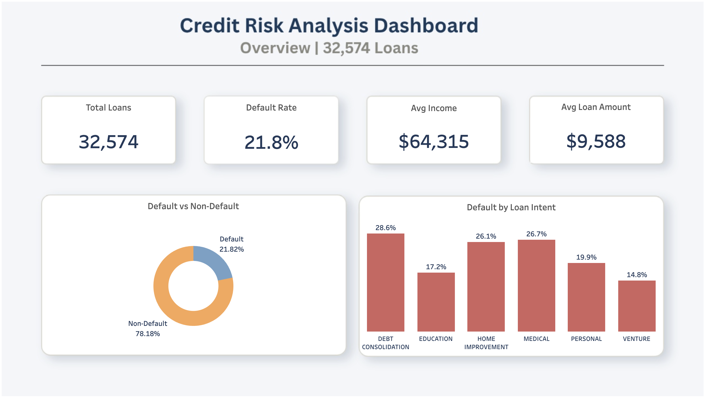
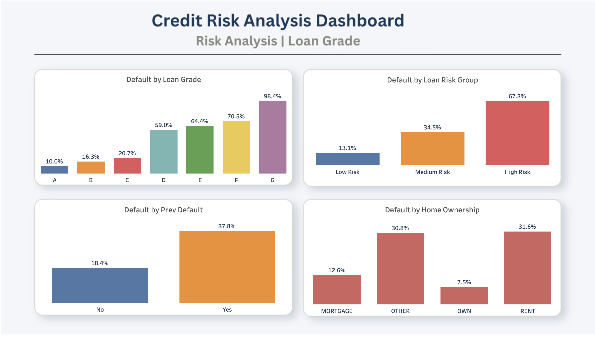
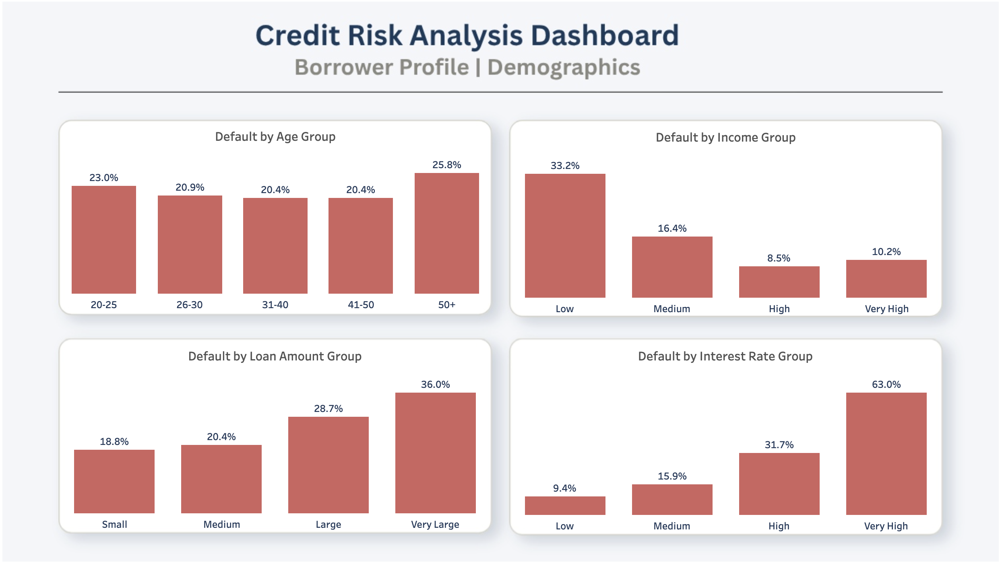

# 💳 Credit Risk Analysis

An end-to-end Data Analytics project covering data cleaning,
exploratory data analysis, and interactive dashboard development
on the Credit Risk dataset.

---

## 📌 Project Overview

This project analyzes **32,574 loan records** to identify
the key drivers of loan default and provide actionable
recommendations for credit risk management.

| Detail | Info |
|--------|------|
| Dataset | [Credit Risk Dataset (Kaggle)](https://www.kaggle.com/datasets/laotse/credit-risk-dataset) |
| Records | 32,574 loans |
| Features | 12 columns |
| Default Rate | 21.8% |

---

## 🛠️ Tools & Technologies

| Tool | Purpose |
|------|---------|
| Python (Pandas, Seaborn, Matplotlib) | Data cleaning, EDA & Visualization |
| Tableau Public | Interactive Dashboard |
| Microsoft Word | Formal Report |
| SQL | Exploratory Data Analysis |

---

## 🧹 Data Cleaning Process

| Step | Action | Result |
|------|--------|--------|
| Outliers | Removed age > 100, emp_length > 60 | Cleaner distribution |
| Income Cap | Capped at 99th percentile ($225,000) | Removed extreme outliers |
| Missing Values | loan_int_rate filled with median by loan_grade | More accurate imputation |
| Missing Values | emp_length filled with median | No data loss |
| Label Mapping | loan_status → loan_status_label | Human readable |
| Binning | age, income, loan_amount, interest_rate → groups | Grouped for analysis |
| Risk Grouping | loan_grade → loan_risk (Low/Medium/High Risk) | Risk categorization |

---

## 📊 Key Findings & Insights

### 🔴 Default Overview
- **Overall Default Rate:** 21.8% — 1 in 5 loans defaults
- **Grade G loans** default at **98.4%** — almost certain default
- **Low income borrowers** default at **33.2%** — 4x higher than high income

### 🏦 Risk Analysis
- **High Risk loans** (Grade E, F, G) have **67.3% default rate**
- **Previous defaulters** are twice as likely to default again **(37.8% vs 18.4%)**
- **Renters** have the highest default rate **(31.6%)** vs home owners **(7.5%)**

### 💰 Loan Characteristics
- **Debt Consolidation** loans default the most **(28.6%)**
- **Venture** loans default the least **(14.8%)**
- **Interest rate** and **loan-to-income ratio** are strongest numeric predictors

---

## 📋 Interactive Dashboard

### Dashboard 1 — Overview

### Dashboard 2 — Risk Analysis

### Dashboard 3 — Borrower Profile

🔗 **[View Live Dashboard on Tableau Public](https://public.tableau.com/app/profile/mehedi.hasan2176/viz/CreditRiskAnalysis_17782100213550/OverView)**

---

## 💡 Business Recommendations

1. **Loan Grade** — Avoid approving Grade E, F, G loans without additional collateral
2. **Income Verification** — Low income applicants need closer scrutiny
3. **Previous Default** — Flag applicants with default history, require extra documentation
4. **Debt Consolidation** — Introduce special monitoring for high default intent loans
5. **Home Ownership** — Consider ownership status as a key approval factor

---

## 📂 Project Structure

credit-risk-analysis/
├── images/
│   ├── dashboard_1.png
│   ├── dashboard_2.png
│   └── dashboard_3.png
├── notebook/
│   ├── credit_risk_cleaning.ipynb
│   └── credit_risk_eda.ipynb
├── report/
│   └── Credit_Risk_Analysis.docx
├── credit_risk_cleaned.csv
└── README.md

---

## 👤 Author

**Mehedi Hasan**

